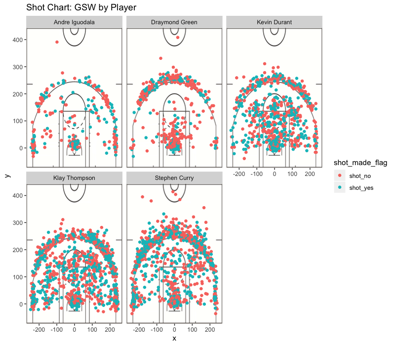

Workout 1
================
Noah Forougi
March 2nd, 2019

Golden State Warriors - An Analysis of the 2016 Team's Incredible Shooting
==========================================================================

Background and Introduction
---------------------------

The Golden State Warriors had an historic run in the 2016 season. Winning an NBA record 73 games, this team made it to the NBA finals, where they lost in a 7 game series against the Cleveland Cavaliers, led by Lebron James. The 2016 Warriors, however, made an impact on the league in other ways as well. The shooting of the Warriors in 2016 led the league in their memorable season in a variety of aspects. This paper will shed some light into the historic shooting season of the Golden State Warriors by taking an in-depth look at the starting 5 players - Stephen Curry, Klay Thompson, Kevin Durant, Andre Igoudala and Draymond Green.

Data
----

The data obtained in this project came from the github homework branch of Statistics 133. The data consisted of detailed breakdowns of 5 players shooting throughout the 2015-16 season - Stephen Curry, Klay Thompson, Kevin Durant, Andre Igoudala and Draymond Green. Within each of these comma separated value documents, there were 13 variables which included: team name, date of the game, the season, the quarter of the game, minutes and seconds remaining, whether the shot was made or not, how the shot was scored, distance from which the shot was made, team opponent, and x and y coordinates in feet of where the shot was made. This detailed amount of initial data allowed for some interesting manipulation and analysis of the data. A data dictionary can be found within the data directory that provides a more detailed explanation of each of the variables.

Analysis
--------

This project involved the manipulation and presentation of shooting data for the Warriors starters. Garnered from the Statistics 133 Github repository, we will take a deeper look into how this data was coded through R-scripts and then presented using ggplot2.

#### Data Preparation

The first step in this project was to prepare this data. In an R-script that can be found in the code directory, there is a more detailed look at the technical steps I took to prepare data. Here, I will provide more of a broad overview of the necessary steps. The data was imported using the command line and I began with 5 separate csv files. The first step I took was to create more variables than the 13 initial variables. The first added variable was called "name" and this was simply a variable that contained the name of the player; this step would be very useful in a later phase when it was necessary to group the variables by the player. Another variable I created was called "minutes" - this variable was created as function of the quarter and minutes remaining. It denoted in which minute the shot was taken and was coded as follows (for Stephen Curry):

``` r
curry$minute <- 12*curry$period - curry$minutes_remaining
```

Following the final manipulations of variables, summaries for each players were exported as txt files in the data folder. After this step, my next step was to create an aggregated tibble object of all the players. This step was finalized by using the rbind() function to combine the data from each player into the tibble object "shots\_data", of which a summary can be found in the data folder. Once this aggregated object was finalized, the next step was to move on to visualizations of the data.

#### Primary Data Visualizations

The primary objective in this project was to visualize the shooting of the Golden State Warriors' starting 5 players. In fulfilling this objective, I created a grid of charts that portrays the shots taken by each individual throughout the year. This series of charts separates the charts by players as well as by the distinction of whether or not the shot was made. Furthermore, I overlayed a scaled image of a basketball court to provide context as to where the shot was taken on the court.



This chart was created using ggplot2. The facet\_wrap() arugment within ggplot2() allowed me to creat a series of graphs in one image to compare shooting patterns by player.

#### Other Analyses

Another way to investigate the truly historic shooting season of the Warriors is to take a look at the effective shooting percentage of their players. We will take a deeper look at this by investigating the effective shooting percentages of each player based on shot type, as well as in total. The term effective shooting percentage is a commonly used basketball statistics. This stat allows analysts and team managers to look at the effectiveness of a players shooting. While this can be theoretically used on an overall level to look at the effective shooting percentages of all players in the NBA, this paper will look at a smaller sample of the starting 5 players on the 2016 Warriors. Because of the historic season and the record-breaking amount of wins, these futher analyses will display numeric tables that will put a number on their incredible shooting.

**2 Point Effective Shooting Percentage by Player** We will first look at the 2PT Effective Shooting Percentage by Player. This is also commonly referred to as the effective field goal shooting percentage. In this table, as with all the following tables, we display the name of the player, their total attempted number of shots, the total made shots, and the perctange of those shots made. We will save the analysis for the next section, but given a quick look, we can see who the player leading in field goal effectiveness is - Andre Igoudala.

<table class="gmisc_table" style="border-collapse: collapse; margin-top: 1em; margin-bottom: 1em;">
<thead>
<tr>
<td colspan="4" style="text-align: left;">
2 Point Effective Shooting Percentage by Player
</td>
</tr>
<tr>
<th style="border-bottom: 1px solid grey; border-top: 2px solid grey;">
</th>
<th style="border-bottom: 1px solid grey; border-top: 2px solid grey; text-align: center;">
Made Shots
</th>
<th style="border-bottom: 1px solid grey; border-top: 2px solid grey; text-align: center;">
Total Shots
</th>
<th style="border-bottom: 1px solid grey; border-top: 2px solid grey; text-align: center;">
Percentage Shots Made
</th>
</tr>
</thead>
<tbody>
<tr>
<td style="text-align: left;">
Andre Igoudala
</td>
<td style="text-align: center;">
134
</td>
<td style="text-align: center;">
210
</td>
<td style="text-align: center;">
63.8095238095238
</td>
</tr>
<tr>
<td style="text-align: left;">
Kevin Durant
</td>
<td style="text-align: center;">
390
</td>
<td style="text-align: center;">
643
</td>
<td style="text-align: center;">
60.6531881804044
</td>
</tr>
<tr>
<td style="text-align: left;">
Stephen Curry
</td>
<td style="text-align: center;">
304
</td>
<td style="text-align: center;">
563
</td>
<td style="text-align: center;">
53.9964476021314
</td>
</tr>
<tr>
<td style="text-align: left;">
Klay Thompson
</td>
<td style="text-align: center;">
329
</td>
<td style="text-align: center;">
640
</td>
<td style="text-align: center;">
51.40625
</td>
</tr>
<tr>
<td style="border-bottom: 2px solid grey; text-align: left;">
Draymond Green
</td>
<td style="border-bottom: 2px solid grey; text-align: center;">
171
</td>
<td style="border-bottom: 2px solid grey; text-align: center;">
346
</td>
<td style="border-bottom: 2px solid grey; text-align: center;">
49.4219653179191
</td>
</tr>
</tbody>
</table>
**3 Point Effective Shooting by Player** Similarily as above, this chart looks at the 3PT Effective Shooting Percentage of the starting 5 Warriors, in 2016. Once again, we will save a deeper analysis for the next section, but a quick overview and comparison of this shot demonstrates that 3PT effectiveness is much less than Field Goal effectiveness.

<table class="gmisc_table" style="border-collapse: collapse; margin-top: 1em; margin-bottom: 1em;">
<thead>
<tr>
<td colspan="4" style="text-align: left;">
3 Point Effective Shooting Percentage by Player
</td>
</tr>
<tr>
<th style="border-bottom: 1px solid grey; border-top: 2px solid grey;">
</th>
<th style="border-bottom: 1px solid grey; border-top: 2px solid grey; text-align: center;">
Made Shots
</th>
<th style="border-bottom: 1px solid grey; border-top: 2px solid grey; text-align: center;">
Total Shots
</th>
<th style="border-bottom: 1px solid grey; border-top: 2px solid grey; text-align: center;">
Percentage Shots Made
</th>
</tr>
</thead>
<tbody>
<tr>
<td style="text-align: left;">
Klay Thompson
</td>
<td style="text-align: center;">
246
</td>
<td style="text-align: center;">
580
</td>
<td style="text-align: center;">
42.4137931034483
</td>
</tr>
<tr>
<td style="text-align: left;">
Stephen Curry
</td>
<td style="text-align: center;">
280
</td>
<td style="text-align: center;">
687
</td>
<td style="text-align: center;">
40.7569141193595
</td>
</tr>
<tr>
<td style="text-align: left;">
Kevin Durant
</td>
<td style="text-align: center;">
105
</td>
<td style="text-align: center;">
272
</td>
<td style="text-align: center;">
38.6029411764706
</td>
</tr>
<tr>
<td style="text-align: left;">
Andre Igoudala
</td>
<td style="text-align: center;">
58
</td>
<td style="text-align: center;">
161
</td>
<td style="text-align: center;">
36.0248447204969
</td>
</tr>
<tr>
<td style="border-bottom: 2px solid grey; text-align: left;">
Draymond Green
</td>
<td style="border-bottom: 2px solid grey; text-align: center;">
74
</td>
<td style="border-bottom: 2px solid grey; text-align: center;">
232
</td>
<td style="border-bottom: 2px solid grey; text-align: center;">
31.8965517241379
</td>
</tr>
</tbody>
</table>
**Effective Shooting Percentage by Player** Finally, we create a table that includes all shots and overall percentages, which is called Effective Shooting Percentage by Player. This table is essentially a sum of the two tables produced earlier. Arranged by descending order, this table shows a more complete picture of the shooting effectiveness but does not demonstrate shooting patterns as well.

<table class="gmisc_table" style="border-collapse: collapse; margin-top: 1em; margin-bottom: 1em;">
<thead>
<tr>
<td colspan="4" style="text-align: left;">
Effective Shooting Percentage by Player
</td>
</tr>
<tr>
<th style="border-bottom: 1px solid grey; border-top: 2px solid grey;">
</th>
<th style="border-bottom: 1px solid grey; border-top: 2px solid grey; text-align: center;">
Made Shots
</th>
<th style="border-bottom: 1px solid grey; border-top: 2px solid grey; text-align: center;">
Total Shots
</th>
<th style="border-bottom: 1px solid grey; border-top: 2px solid grey; text-align: center;">
Percentage Shots Made
</th>
</tr>
</thead>
<tbody>
<tr>
<td style="text-align: left;">
Kevin Durant
</td>
<td style="text-align: center;">
495
</td>
<td style="text-align: center;">
915
</td>
<td style="text-align: center;">
54.0983606557377
</td>
</tr>
<tr>
<td style="text-align: left;">
Andre Igoudala
</td>
<td style="text-align: center;">
192
</td>
<td style="text-align: center;">
371
</td>
<td style="text-align: center;">
51.7520215633423
</td>
</tr>
<tr>
<td style="text-align: left;">
Klay Thompson
</td>
<td style="text-align: center;">
575
</td>
<td style="text-align: center;">
1220
</td>
<td style="text-align: center;">
47.1311475409836
</td>
</tr>
<tr>
<td style="text-align: left;">
Stephen Curry
</td>
<td style="text-align: center;">
584
</td>
<td style="text-align: center;">
1250
</td>
<td style="text-align: center;">
46.72
</td>
</tr>
<tr>
<td style="border-bottom: 2px solid grey; text-align: left;">
Draymond Green
</td>
<td style="border-bottom: 2px solid grey; text-align: center;">
245
</td>
<td style="border-bottom: 2px solid grey; text-align: center;">
578
</td>
<td style="border-bottom: 2px solid grey; text-align: center;">
42.3875432525952
</td>
</tr>
</tbody>
</table>
Discussion
----------

These visualizations and charts provide substantial context for our discussion of the Warriors' shooting patterns, leading scorers, and standard shooting practices. In both a qualitative and quantitative sense, these metrics provide an excellent opportunity to analyze and understand what the roles of each player were on the team, even with out having a strong prior knowledge of the typical style of play of the Warriors.

Firstly, the facetted basketball chart provides an excellent look at the overall patterns of individual player shooting. We can see that there are substantial differences between how certain people prefer to shoot the basketball. Players like Andre Igoudala and Draymond Green are more inclined to shoot the ball closer to the hoop. This suggests that on average, the other players - Kevin Durant, Klay Thompson, and Stephen Curry - are better long distance shooters that these players. Any fan of the warriors can tell you with confidence that this is in fact the case. We can also see that not only are these three players more confident at long distance shooting, but that they are more confident at shooting at nearly every range. These players shots come from nearly every part of the opponent's half of the floor. This frame of logic can intuitively infer that these players - Kevin Durant, Klay Thompson, and Stephen Curry - are the main offensive forces of the Warriors. Most likely, the fact that these players very obviously have more shots and a wider range of shots indicates that these players are the offensive centerpieces of this team. This also implies that Andre Igoudala and Draymond Green are more effective players on the defensive side. This graph of the defensive efficiency rating is a testament to the incredible defensive efficency Draymond Green has.  Another interesting part of this facetted grid of charts is that it shows relative preferences for shot type. For example, Draymond Green prefers to shoot very near the basket or from the top of the key. This can be seen by where his shots are clustered. However, Andre Igoudala prefers to shoot his three-point attempts from the corners. Because this chart breaks down the Warriors' shots by player and by location, it enables a quick and clear analysis of shooting habits and the roles of players.

The next analysis piece to look at is the effective shooting charts. First, we will explore the 2PT Effective Field Goal Shooting. From this chart we can analyze the efficiency of shooting as well as the quantity of shots taken. The first thing to notice is the ranking; the table is listed in decreasing order with respect ot percentage. Andre Igoudala has the highest percentage of field goals made, followed by Durant, Curry, Thompson, and then Green. We can interpret this in a multitude of ways, but it would be shortsighted to not consider the other columns first. We can see that though Igoudala has the highest field goal percentage, his quantity of shots was significantly lower than the rest of the teams, as was Draymonds. This further enforces a point made earlier in this section that Draymond Green and Andre Igoudala are most likely the defensive centerpieces of the team. A final note on this chart is that because Andre Igoudala's effective field goal shooting percentage is the highest, it would be likely that when the team needed consistent points in the late minutes of a game, Andre Igoudala may be the player that the team relies on heavily.

With regards to the three point effective shooting, it is abundantly clear who the primary shooters are. Stephen Curry and Klay Thompson took the large majority of all three point shots for the Warriors in the 2016 season. Not only did these two players, dubbed the "Splash Bros," take the majority of the shots, but they also shot with the highest efficiency. This piece was key to the Warriors' success. It was not merely the quantity of 3-pointers that this team made that was integral to their season's success, but the efficiency with which they shot that really drove their sucess. This chart from SB Nation, a reputable sports journalism website, uses a barplot to demonstrate the historic shooting. Steph Curry and Klay Thompson hold the 1st and 3rd position, respectively, on the most made 3-pointers in a season. 

The final piece of discussion in this paper will revolve around the total effective shooting percentage of these players. While each player assuredly has their specialty, total effective field goal shooting percentage gives a well-rounded look at quantity of shots and the efficiency with which they are made. What we see in this chart has been a player that has been largely left out of the discussion - Kevin Durant. His numbers in field goal shooting and three pointers, while highly impressive, are not at the top of his team. However, when these statistics are looked at as a sum, we can see that Kevin Durant has the highest effective shooting percentage. His shooting is consistent and reliable, whether it is a 3-pointer or a field goal. This fact points to the reliance of this team on Kevin Durant in the late stretches of games, because of his high effectiveness. In total, the Warriors had a truly historic year of shooting. This chart shows the ranking of team effective shooting percentages throughout NBA history.


Conclusion and Suggestions for Future Research
----------------------------------------------

This paper has taken an in-depth look at how the Warriors' season was so historic in shooting and the roles of their starters in this incredible season. Each of the starting 5 had their distinct specialty and roles on the team. Some players were more presumambly more of the defensive mindset, while there are clearly a few players that take the majority of the offensive workload. While this paper looked at the roles of the starters on the Warriors, an important piece that was not analyzed was the bench players. This could be an intriguing area for future research. The starting five players are clearly cruicial to a winning team, but the impact of the players on the bench cannot be overlooked. Understanding the roles of these players and the efficiency with which they shot would provide another interesting perspective to how the Warriors were able to to accomplish all they did in 2016.

References
----------

Are the Warriors Making the Mid-Range Relevant Again? (n.d.). Retrieved from <https://shottracker.com/articles/are-the-warriors-making-the-mid-range-relevant-again>

Imgur, Offensive Plus Minus vs Defensive Plus Minus, accessed March 9th, 2019. <https://i.imgur.com/JJKILc7.png>

Schuhmann, J. (2017, December 14). One Team, One Stat -- Golden State Warriors' shooting the best in NBA history ... again. Retrieved from <https://on.nba.com/2Vv1t2u>

Sherman, R., & Hinog, M. (2016, April 15). A complete breakdown of Steph's 400-three season. Retrieved March 9, 2019, from <https://www.sbnation.com/2016/4/15/11437346/steph-curry-golden-state-warriors-3-point-record>
